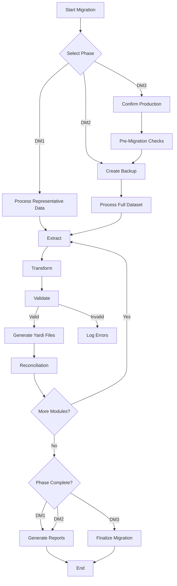

# 🏢 Yardi Data Migration System

> **A robust, professional solution for migrating property management data to Yardi platforms.** Supports a full migration lifecycle from CRP to production with validation, delta processing, rollback, and reconciliation.

---

## 📑 Overview

* **Three-Phase Migration:** CRP → UAT → Production
* **Delta Processing:** Migrate only changed records
* **Validation Framework:** Quality checks at every stage
* **Production Safety:** Rollback system & dual confirmation
* **Encoding Detection:** Handles various file formats
* **Reconciliation Reports:** Ensure data integrity

---

## ⚙️ Prerequisites

* Python **3.9+**
* Packages: see requirements.txt
---

## 📂 Project Structure

```bash
yardi_data_migration/
├── config/
│   ├── dm1_crp.yaml
│   ├── dm2_uat.yaml
│   └── dm3_prod.yaml
├── data/
│   ├── backups/
│   ├── reconciliation/
│   ├── reports/
│   ├── sources/
│   └── yardi_etl/
├── src/
│   ├── delta_processor.py
│   ├── extraction.py
│   ├── orchestration.py
│   ├── transformation.py
│   ├── validation.py
├── run_dm1.py
├── run_dm2.py
├── run_dm3.py
└── requirements.txt
```

---

## 🔄 Execution Workflow



---

## 🚀 Getting Started

### 1️⃣ Configuration Setup

Create YAML configs under `config/`:

```yaml
# config/dm1_crp.yaml
phase: dm1_crp
modules: [leasing, ar, fixed_assets]

field_mappings:
  leasing:
    property_id: PropertyID
    lease_ref: LeaseReference
    tenant_id: TenantID
    lease_start: LeaseCommencementDate

validation_rules:
  leasing:
    required: [PropertyID, LeaseReference, TenantID]
    positive_values: [BaseRent]
```

### 2️⃣ Prepare Source Data

Organize CSVs:

```bash
data/sources/
├── dm1_crp/   # CRP: Representative
├── dm2_uat/   # UAT: Full portfolio
└── dm3_prod/  # Production: Final data
```

### 3️⃣ Run Migrations

```bash
# CRP
python run_dm1.py

# UAT
python run_dm2.py

# Production (requires confirmation)
python run_dm3.py
```

👉 Confirm prompts: Type `PROD` and `CONFIRM` when prompted.

---

## 🔑 Key Components

**Delta Processing**

```python
def get_delta_records(module, config):
    # 1. Detect encoding
    # 2. Load datasets
    # 3. Compare hashes
    # 4. Return new/changed rows
```

**Data Transformation**

```python
def transform_data(df, module, config):
    # 1. Apply field mappings
    # 2. Handle special cases
    # 3. Generate temp IDs
    # 4. Validate business rules
```

**Validation Framework**

```python
def validate_data(df, module, config):
    # 1. Required fields
    # 2. Positive values
    # 3. Value mappings
    # 4. Enforce business rules
```

**Production Safety Features**

* Dual confirmation for production
* Pre-migration checks (files, disk space, config integrity)
* Automatic rollback on critical errors
* Error notifications for production failures

---

## ✅ Best Practices

* Use **UTF-8 without BOM**
* Clean data before migration
* Maintain consistent schemas
* Schedule DM3 during off-peak hours
* Verify backups and disk space before starting
* Obtain stakeholder sign-off for production

---

## 🛠️ Support & Troubleshooting

| Issue                | Solution                        |
| -------------------- | ------------------------------- |
| UnicodeDecodeError   | Use UTF-8 without BOM encoding  |
| Missing source files | Verify files in `data/sources/` |
| Validation failures  | Check `config/validation_rules` |
| Rollback failure     | Ensure sufficient disk space    |

**Log files:** `data/reports/`

* `error_log.txt` — Detailed errors
* `production_errors.log` — Production-specific
* `validation_*.md` — Validation reports

**Manual Rollback Example:**

```bash
python -c "from src.rollback import execute_rollback; execute_rollback('data/backups/dm3_prod_20250705_123456')"
```

---

## 📜 License & Version

* **License:** MIT
* **Version:** 1.0.0

> *Reliable, safe, and professional data migration for Yardi.*
